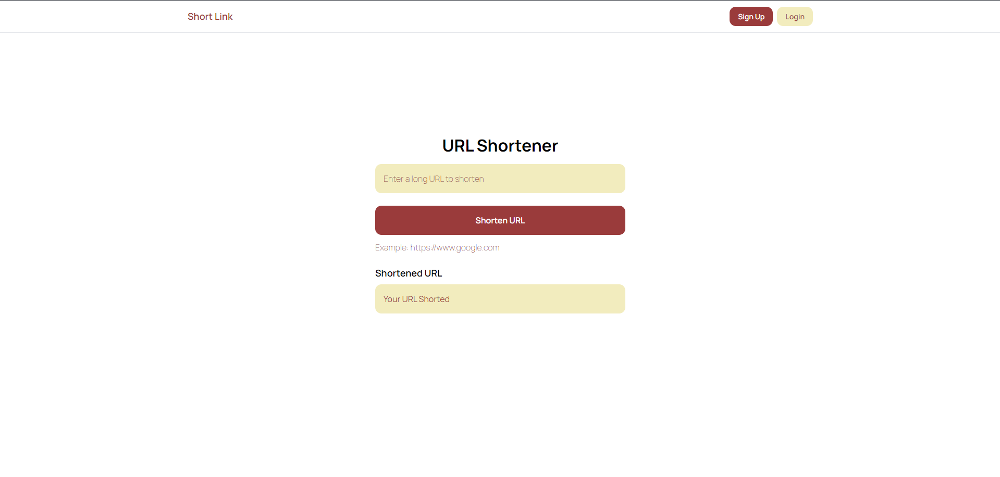
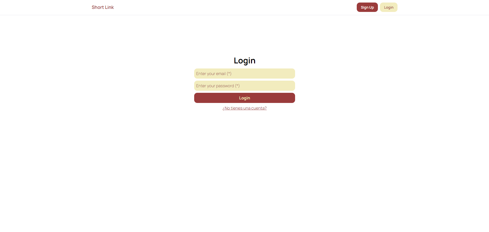
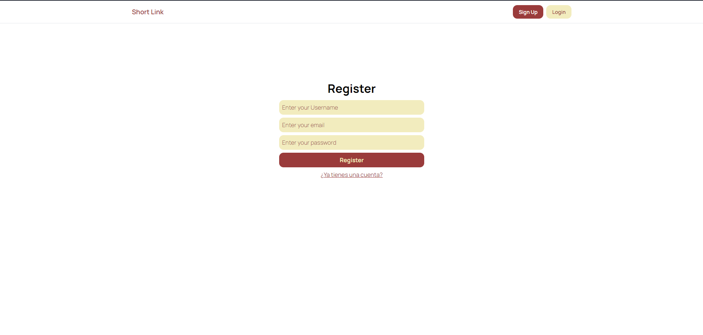

# Shortener
-------

This project is a shortener for links. It allow's shorten links without or anonymous user, but It also allow create accounts for user. This version only allows create users, but don't have management of shorten links with account panel.

## Tools
- MySQL
- Nodejs
- Expressjs
- Sequelize
- ReactJS
- TailwindCSS

Before, in your MySQL you must create a DB with the name declared in your environment variable `DB_NAME` default name is `shortener`.

## Run

After download or cloned repo, you must install the dependences with:

**Backend project:**
```sh
$ cd ./backend
$ npm install
$ npm run dev
```
**Frontend project**
```sh
$ cd ./front
$ npm install
$ npm run dev
```

## Screenshots





Created by: **Juanda**